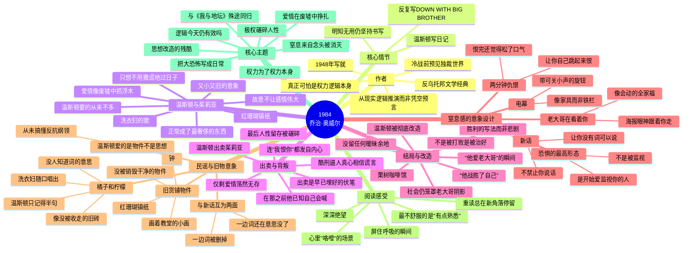

```mermaid
mindmap
  root((1984<br/>乔治·奥威尔))
    作者
      反乌托邦文学经典
      1948年写就
      从现实逻辑推演而非凭空预言
      冷战前预见独裁世界
      真正可怕是权力逻辑本身
    核心情节
      温斯顿写日记
      反复写DOWN WITH BIG BROTHER
      明知无用仍坚持书写
    温斯顿与茱莉亚
      爱情像废墟中抓浮木
      红珊瑚镇纸
      洗衣妇的歌
      又小又旧的意象
      故意不让感情伟大
      温斯顿要的从来不多
      只想不用撒谎地过日子
      正常成了最奢侈的东西
    出卖与背叛
      温斯顿出卖茱莉亚
      仅剩爱情荡然无存
      最后人性留存被碾碎
      酷刑逼人真心相信谎言
      连"我恨你"都发自内心
      出卖是早已埋好的伏笔
      在那之前他已知自己会喊
    结局与改造
      温斯顿被彻底改造
      社会仍笼罩老大哥阴影
      栗树咖啡馆
      "他爱老大哥"的瞬间
      "他战胜了自己"
      胜利的写法而非悲剧
      不是被打败是被治好
      没留任何暧昧余地
    窒息感的意象设计
      电幕
        像家具而非铁栏
        带可关小声的旋钮
      老大哥在看着你
        海报眼神跟着你走
        像会动的全家福
      两分钟仇恨
        让你自己跳起来恨
        恨完还觉得松了口气
      新话
        不禁止你说话
        让你没有词可以说
      恐惧的最高形态
        不是被监视
        是开始爱监视你的人
    民谣与旧物意象
      橘子和柠檬
        洗衣妇随口唱出
        没人知道词的意思
        温斯顿只记得半句
        像没被收走的旧砖
      旧货铺物件
        红珊瑚镇纸
        画着教堂的小画
        钟
        没被销毁干净的物件
      与新话互为两面
        一边词被删掉
        一边词还在意思没了
      温斯顿爱的是物件不是思想
        从未搞懂反抗纲领
    阅读感受
      深深绝望
      心里"咯噔"的场景
      屏住呼吸的瞬间
      重读总在新角落停留
      最不舒服的是"有点熟悉"
    核心主题
      极权碾碎人性
      爱情在废墟中挣扎
      思想改造的残酷
      窒息来自念头被消灭
      权力为了权力本身
      逻辑今天仍有效吗
      把大恐怖写成日常
      与《我与地坛》殊途同归
```