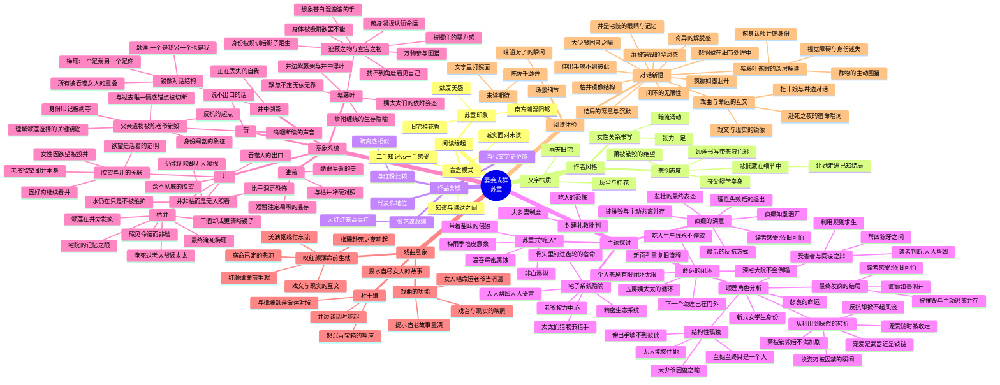

```mermaid
mindmap
  root((妻妾成群<br/>苏童))
    阅读缘起
      盲盒模式
        知道与读过之间
        诚实面对未读
        二手知识vs一手感受
      苏童印象
        南方潮湿阴郁
        颓废美感
        旧宅桂花香
    作者风格
      文字气质
        雨天旧宅
        灰尘与桂花
      女性关系书写
        暗流涌动
        张力十足
      悲悯态度
        颂莲书写带悲哀色彩
        丧父辍学卖身
        萧被销毁的绝望
        悲悯藏在细节中
          让她走进已知结局
    作品关联
      代表作地位
      当代文学史位置
      张艺谋改编
        大红灯笼高高挂
      与红粉比较
        疏离感相似
    主题探讨
      封建礼教批判
        一夫多妻制度
        吃人的恐怖
      颂莲角色分析
        悲哀的命运
        新式女学生身份
        受害者与同谋之辩
          利用规则求生
          帮凶獠牙之问
          读者判断:人人帮凶
        从利用到厌倦的转折
          宠爱是武器还是锁链
          换姿势被囚禁的瞬间
          宠爱随时被收走
          萧被销毁后不满加剧
          反抗却掀不起风浪
        结构性孤独
          无人能接住她
          大少爷困兽之喻
          伸出手够不到彼此
          至始至终只是一个人
        最终发疯的结局
          被摧毁与主动逃离并存
          疯癫如墨洇开
          读者感受:依旧可怕
      苏童式"吃人"
        温吞绵密腐蚀
        非血淋淋
        梅雨季墙皮意象
        带着甜味的侵蚀
      宅子系统隐喻
        精密生态系统
        老爷权力中心
        太太们猎物兼猎手
        人人帮凶人人受害
        骨头里钉进齿轮的宿命
      疯癫的深意
        最后的反抗方式
        理性失效后的退出
        悲壮的最终表态
        被摧毁与主动逃离并存
        疯癫如墨洇开
        读者感受:依旧可怕
      命运的闭环
        五房姨太太的循环
        个人悲剧有限闭环无限
        下一个颂莲已在门外
        深宅大院不会倒塌
        吃人生产线永不停歇
        新面孔重复旧流程
    意象系统
      井
        深不见底的欲望
        吞噬人的出口
        枯井
          淹死过老太爷姨太太
          最终淹死梅珊
          颂莲在井旁发疯
          干涸却成更清晰镜子
          照见命运而非脸
          宅院的记忆之眼
        井非枯而是无人照看
          水仍在只是不被维护
          比干涸更恐怖
          仍能倒映却无人凝视
        欲望与井的关联
          女性因欲望被投井
          因好奇继续看井
          欲望是活着的证明
          老爷欲望即井本身
      井中倒影
        正在丢失的自我
        镜像对话结构
          颂莲:一个是我另一个也是我
          梅珊:一个是我另一个是你
          所有被吞噬女人的重叠
      紫藤叶
        攀附缠绕的生存隐喻
        姨太太们的依附姿态
        井边紫藤架与井中浮叶
        飘忽不定无依无靠
        遮蔽之物与宣告之物
          找不到角度看见自己
          身份被规训后影子陌生
          想象苍白湿漉漉的手
          被攫住的暴力感
          身体被吸附欲罢不能
          俯身凝视认领命运
          万物参与围猎
      萧
        呜咽断续的声音
        说不出口的话
        父亲遗物被陈老爷销毁
          身份印记被剥夺
          身份阉割的象征
          与过去唯一情感锚点被切断
          理解颂莲选择的关键钥匙
          反抗的起点
      雏菊
        脆弱易逝的美
        与枯井冷硬对照
        短暂注定凋零的温存
    戏曲意象
      杜十娘
        井边谈话时响起
        怒沉百宝箱的呼应
        投水自尽女人的故事
        与梅珊颂莲命运对照
      叹红颜薄命前生就
        梅珊赴死之夜响起
        宿命已定的悲凉
        红颜薄命前生就
        美满姻缘付东流
        戏文与现实的互文
      戏曲的功能
        提示古老故事重演
        戏台与现实的映照
        女人唱命运老爷当消遣
    阅读体验
      场景细节
        味道对了的瞬间
      未读期待
        陈佐千颂莲
        文字里打照面
      对话新悟
        大少爷困兽之喻
        伸出手够不到彼此
        疯癫如墨洇开
        奇异的解脱感
        结局的寒意与沉默
        闭环的无限性
        枯井镜像结构
        井是宅院的眼睛与记忆
        萧被销毁的窒息感
        悲悯藏在细节处理中
        紫藤叶遮眼的深层解读
          视觉障碍与身份迷失
          静物的主动围猎
          俯身认领井底身份
        戏曲与命运的互文
          杜十娘与井边对话
          赴死之夜的宿命唱词
          戏文与现实的镜像
```