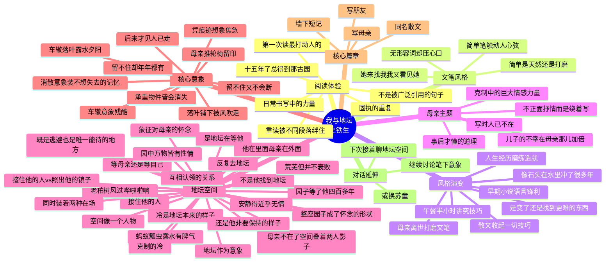

```mermaid
mindmap
  root((我与地坛<br/>史铁生))
    阅读体验
      重读被不同段落绊住
      固执的重复
      十五年了总得到那古园
      日常书写中的力量
      第一次读最打动人的
      不是被广泛引用的句子
    文笔风格
      简单笔触动人心弦
      无形容词却压心口
      她来找我我又看见她
      简单是天然还是打磨
    风格演变
      早期小说语言锋利
      午餐半小时讲究技巧
      散文收起一切技巧
      是变了还是找到更难的东西
      人生经历磨练造就
      母亲离世打磨文笔
      像石头在水里冲了很多年
    母亲主题
      不正面抒情而是绕着写
      儿子的不幸在母亲那儿加倍
      事后才懂的道理
      写时人已不在
      克制中的巨大情感力量
    地坛空间
      反复去地坛
      等母亲还是等自己
      既是逃避也是唯一能待的地方
      空间像一个人物
      地坛作为意象
      接住他的人
      象征对母亲的怀念
      园中万物皆有性情
      老柏树风过哗啦啦响
      蚂蚁瓢虫露水有脾气
      园子等了他四百多年
      不是他找到地坛
      是地坛在等他
      互相认领的关系
      接住他的人vs照出他的镜子
      同时装着两种在场
      他在里面母亲在外面
      母亲不在了空间叠着两人影子
      整座园子成了怀念的形状
      克制的冷
      荒芜但并不衰败
      安静得近乎无情
      冷是地坛本来的样子
      还是他非要保持的样子
    核心意象
      车辙意象残酷
      母亲推轮椅留印
      后来才见人已走
      凭痕迹想象焦急
      落叶铺下被风吹走
      留不住却年年都有
      留不住又不会断
      车辙落叶露水夕阳
      承重物件皆会消失
      消散意象装不想失去的记忆
    核心篇章
      同名散文
      写母亲
      写朋友
      墙下短记
    对话延伸
      下次接着聊地坛空间
      继续讨论笔下意象
      或换苏童
```