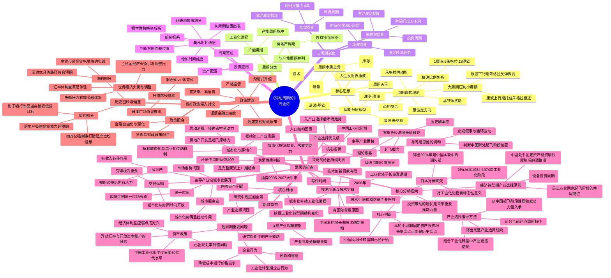

```mermaid
mindmap
  root((《涛动周期论》<br/>周金涛))
    核心思想
      人生发财靠康波
      周期嵌套理论
        齿轮咬合
        康波定方向
        朱格拉供动能
        基钦做扰动
        精确比例关系
          1康波:6朱格拉:18基钦
        大周期压制小周期
          康波下行期朱格拉反弹微弱
          康波上行期托住朱格拉衰退
      周期天王
      周期分层模型
        潮汐-康波
        海浪-朱格拉
        涟漪-基钦
      周期本质差异
        短周期-心理(库存)
        中周期-机械(设备)
        长周期-宿命(技术)
    周期分类
      产能周期
        工业化进程
        产能周期脉冲
      房地产周期
        与产能周期并列
        各有独立脉冲
    三周期嵌套
      康波周期
        决定经济趋势
        时间尺度:50-60年
      朱格拉周期
        投资周期
        决定波动幅度
        时间尺度:8-10年
      基钦周期
        库存周期
        决定波动幅度
        时间尺度:3-4年
    投资应用
      周期定位
      资产配置
      美林时钟改进
        新坐标系
        从周期位置出发
        非静态象限划分
        根本性替换坐标系
        增加时间维度
        判断方向而非位置
    繁荣的起点
      写作时间
        2006年
      核心目标
        挖掘工业化转型期结构变化
        研究中观层面全景
        回答两个问题
          产业选择问题
          市场走势问题
      核心逻辑
        康波周期位置推导
        中国工业化阶段
        人口结构因素
      产业选择优先级
        先产业选择后市场走势
      繁荣性质判断
        指向2005-2007大牛市
        是完整康波上升期起点
        还是中周期反弹起点
        未明确给出持续时间
      核心分析框架
        经济转型期产业选择原则
          中国处于固定资产投资剧烈膨胀后的调整期
          是工业化国家起飞阶段的共同特征
          表现明显的周期：朱格拉周期(设备投资周期)
        日本对标研究
          对标日本1954-1974年工业化阶段
          得出2004年是中国本轮中周期头部
          对工业化进程有标志性意义
        核心判断
          投资带动的增长是未来重要推动力量
          本轮中周期固定资产投资增长率高点可能是历史高点
          中国高增长转型期已经开始
        产业选择推导方法
          从中国起飞阶段性质和发动力量入手
          结合工业化转型中产业更迭结论
          结合当前经济周期特征
          得出完整产业选择线索
      理论根基
        罗斯托经济增长阶段论
          主导产业更替
          起飞概念
          历史剧本感
        与周期思维的调和
          宏观叙事与循环波动
          判断中国所处起飞阶段位置
      技术创新与技术扩散
        中国本轮增长非技术创新推动
        有国际背景原因
        城市化带动工业化进程
        工业化处于长波衰退期
        技术引进和模仿是主要任务
        技术创新贡献有限
      城市化与房地产
        房地产开发是起飞原动力
        解释城市化与工业化传动机制
        城市化解决就业、吸收劳动力
        启动消费、转移农村劳动力
        推动第三产业发展
      主导产业沿城市化展开
        房地产
          有收入转移作用
          短期调整后仍有活力
        交通运输
          城市化从封闭转向开放
          变得极为重要
        统一市场
          加快全国统一市场形成
        城市服务业
          城市化有明显拉动作用
      后续章节
        寻找产业周期底部
          产业周期分解是关键
          研究周期中的产业轮动
        短周期重要问题
          货币政策
            中国工业化水平仅日本60年代水平
            已出现汇率升值问题
            浮动汇率与开放资本账户的风险
            经济体制监控弱点成死穴
          企业行为
            工业化转型期企业行为
            降低成本进行价格竞争
            创新和重组
    货币政策深入讨论
      世界经济失衡与调整
        主导国经济失衡引发调整压力
        失衡压力转嫁金融体系
        汇率体制变革是体现
      升值路径选择
        渐进式 vs 休克式
        日本广场协议教训
      政策配合
        货币与财政政策配合
        金融自由化与深化
      政策建议
        宽货币、紧信贷
        渐进式升值
        谨慎金融自由化
        适度宽松财政政策
        严格监督
      历史回顾与偏差
        准的部分
          宽货币紧信贷格局隐约实践
          渐进式升值路径符合预期
        偏的部分
          四万亿强刺激打破适度宽松设想
          影子银行等渠道突破紧信贷目标
          房地产吸附信贷能力超预期
```